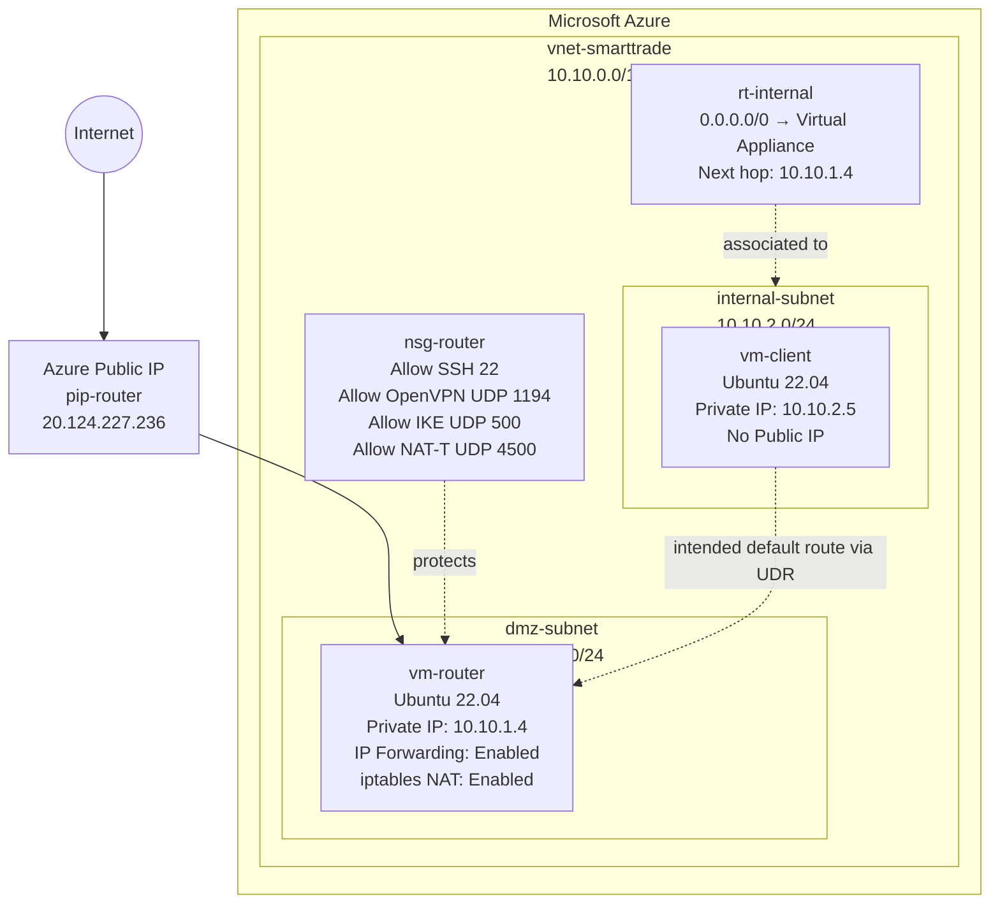

# Architecture Diagram

## Mermaid Diagram

## Design Notes

This lab models an Azure NVA pattern using a Linux VM as a software router. The router VM is placed in a DMZ subnet and exposed through a controlled public IP and NSG rules. The internal client VM has no public IP and resides in a separate internal subnet.

The internal subnet was associated with a route table that forwards default traffic to the router VM as a virtual appliance next hop.
